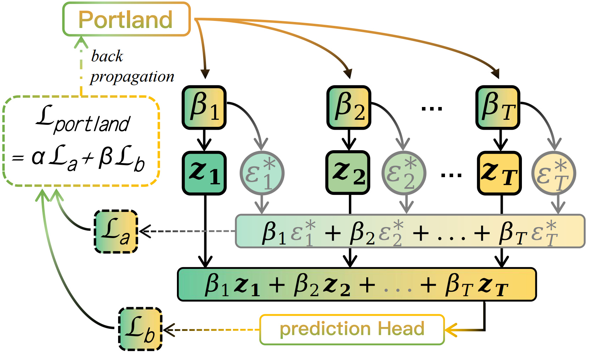

<div align="center">
<h1>Multi-Level Collaboration in Model Merging</h1>

<div>
<a target="_blank" href="https://arxiv.org/abs/***">
  
</a>
</div>

<div>
Qi Li&emsp;Runpeng Yu&emsp;Xinchao Wang<sup>&dagger;</sup>
</div>
<div>
    <a href="https://sites.google.com/view/xml-nus/people?authuser=0" target="_blank">xML-Lab</a>, National University of Singapore&emsp;
    <sup>&dagger;</sup>corresponding author 
</div>
</div>
</div>

## Graphical Abstract
<table align="center">
    <tr>
        <td align="center">
            
            <p>Figure 1. An illustration of Portland, which consists of a linear layer followed by a softmax function.</p>
        </td>
        <td align="center">
            
            <p>Figure 2. The training process of Portland. </p>
        </td>
    </tr>
</table>

<table align="center">
    <tr>
        <td align="center">
            
            <p>Figure 3. A toy experiment to verify theoretical feasibility. In this experiment, we merged two models that were fine-tuned on different datasets. `Marker shapes` represent different methods, while `colors indicate different experimental groups, with each group using a distinct combination of datasets. In total, 10 groups are conducted (represented by 10 different colors). `Hollow markers` for each method indicate the average results across these 10 groups.</p>
        </td>
        <td align="center">
            
            <p>Table 1. The asterisk indicates that the condition is `partially satisfied`. For Simple-Averaging, the theoretical discussion is limited to the relationship between the performance of merging two models and that of ensembling. Furthermore, although both Simple-Averaging and Task-Arithmetic can be applied to CNN-based models, their performance is suboptimal. In the case of Diverse-Origin Models, all previous methods yield performance close to random guessing, but our conclusions remain applicable. </p>
        </td>
    </tr>
</table>

## Installation & Preparation

1. Clone the repo and prepare the virtual environment.

```
git clone https://github.com/LiQiiiii/Neural-Ligand.git
```

```
cd Neural-Ligand
```

```
conda create -n neulig python=3.8.10
```

```
conda activate neulig
```

The codes are tested on torch 2.0.0 and torchvision 0.15.1.

2. Prepare the dataset and models. The download link of the datasets used in the paper can be found in /data/data_links.txt. Run:

```
python ./src/finetune_clean.py
```

to get the corresponding models for the training and evaluation.

---

## Training & Evaluation

```
python ./src/neulig_main.py --num_co_models 2 --global_epoch 100 --alignment_type sup --model RN50
```

where `--num_co_models` is the number of collaborating models, `--alignment_type` controls the alignment term (i.e., sup/semi), and `--model` controls the model type (i.e., RN50/ViT-B-32/ViT-L-14).
